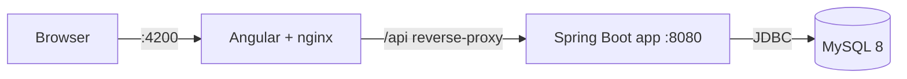
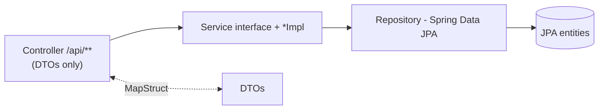

# Book Store App

A full-stack online book store: a stateless **Spring Boot 3.5 / Java 17** REST API with
JWT authentication, MySQL persistence, and an **Angular 22** single-page frontend.
The whole stack (database + API + UI) runs in Docker with a single command.

---

## Tech stack

| Layer      | Technology                                                                 |
|------------|----------------------------------------------------------------------------|
| Backend    | Spring Boot 3.5, Java 17, Spring Security (JWT), Spring Data JPA            |
| Database   | MySQL 8, schema managed by **Liquibase** (Hibernate `ddl-auto=validate`)   |
| Mapping    | MapStruct (entity ↔ DTO)                                                    |
| API docs   | Springdoc OpenAPI / Swagger UI                                             |
| Frontend   | Angular 22 (standalone components, Angular Material, signals), served by nginx |
| Build      | Maven (`./mvnw` wrapper), Spotless + Checkstyle enforced at build time     |
| Tests      | JUnit 5, Mockito, Testcontainers (real MySQL)                              |

---

## Quick start (one command)

> Requires only **Docker** + **Docker Compose**. No local Java, Maven or Node needed —
> the jar and the Angular bundle are built inside the images.

```bash
cp .env.example .env      # demo defaults work as-is; only the DB password is a placeholder
docker compose up -d      # builds and starts mysqldb + app + frontend
```

Then open:

| Service      | URL                                            |
|--------------|------------------------------------------------|
| Frontend UI  | http://localhost:4200                          |
| REST API     | http://localhost:8088/api                      |
| Swagger UI   | http://localhost:8088/swagger-ui/index.html    |
| OpenAPI JSON | http://localhost:8088/v3/api-docs              |
| MySQL        | `localhost:3307` (db `book_app`, user `root`)  |

Stop everything with `docker compose down` (add `-v` to also drop the DB volume).

### Demo accounts (seeded automatically)

| Email             | Password     | Roles        |
|-------------------|--------------|--------------|
| `user@gmail.com`  | `user12345`  | USER         |
| `admin@gmail.com` | `admin12345` | USER + ADMIN |

Log in via the UI, or `POST /api/auth/login` → use the returned token as
`Authorization: Bearer <token>`.

---

## Architecture

### Container topology



In Docker, nginx reverse-proxies `/api` → `app:8080`, so the browser only ever makes
**same-origin** calls (CORS is a non-issue). Locally, `ng serve` proxies `/api` → `localhost:8088`.

### Request flow (backend layering)



- **Controllers** speak DTOs only; **MapStruct** mappers convert entity ↔ DTO.
- **Services** are split per domain (`service/book`, `service/order`, `service/shoppingcart`, …),
  each an interface + `*Impl`.
- **Security**: stateless JWT. `JwtAuthenticationFilter` runs before
  `UsernamePasswordAuthenticationFilter`, validates the bearer token and populates the
  `SecurityContext`. Method-level authorization via `@PreAuthorize`. Passwords hashed with BCrypt.
  Only `/api/auth/**`, Swagger and static assets are public.
- **Dynamic book search** (`GET /api/books/search`) uses a JPA Specification framework — one
  `SpecificationProvider` `@Component` per searchable field, assembled by `BookSpecificationBuilder`.
- **Database**: Liquibase owns the schema (`src/main/resources/db/changelog/`); Hibernate only
  validates. Add a new numbered changeset when an entity changes — never edit an applied one.

### Main endpoints

| Method | Path                              | Notes                          |
|--------|-----------------------------------|--------------------------------|
| POST   | `/api/auth/registration`          | public                         |
| POST   | `/api/auth/login`                 | public → returns JWT           |
| GET    | `/api/users/me`                   | current user + roles           |
| GET    | `/api/books`, `/api/books/{id}`   | browse books                   |
| GET    | `/api/books/search`               | dynamic search (Specification) |
| POST/PUT/DELETE | `/api/books`             | ADMIN                          |
| GET/POST/PUT/DELETE | `/api/categories`    | manage categories              |
| GET/POST/PUT/DELETE | `/api/cart`          | shopping cart + cart-items     |
| GET/POST | `/api/orders`                   | place / list orders            |
| PATCH  | `/api/orders/{id}`                | update order status (ADMIN)    |

Full, always-current contract: **Swagger UI** at `/swagger-ui/index.html`.

---

## Local development (without Docker)

Backend (needs MySQL on `localhost:3306`, see `src/main/resources/application.properties`):

```bash
./mvnw spring-boot:run          # run the API
./mvnw clean package            # build (runs Checkstyle + Spotless)
./mvnw test                     # all tests (spins up MySQL via Testcontainers)
./mvnw test -Dtest=BookRepositoryTest   # single class
./mvnw spotless:apply           # auto-format
```

Frontend (run inside `frontend/`):

```bash
npm install
npm start        # dev server on http://localhost:4200 (proxies /api -> :8088)
npm run build
npm test         # vitest
```

> On a WSL `/mnt/c` checkout npm may not create `node_modules/.bin`; invoke the CLI via
> `node node_modules/@angular/cli/bin/ng.js <cmd>`.

---

## Configuration

All Docker ports and DB credentials come from `.env` (see `.env.example`). Note that
`application.properties` (localhost:3306, password `password`) targets **non-Docker local runs
only** and intentionally differs from the Docker `.env` values.

## Project layout

```
src/main/java/mate/academy/bookstoreappspring/
  controller/   service/   repository/   model/   dto/   mapper/
  security/     validation/ exception/   config/  util/
src/main/resources/db/changelog/   # Liquibase changesets
frontend/                          # Angular 22 SPA (+ nginx.conf, proxy.conf.json)
docs/                              # design specs & notes
docker-compose.yml                 # full stack
docker-compose.test.yml            # isolated smoke-test stack (only publishes 4200)
```
